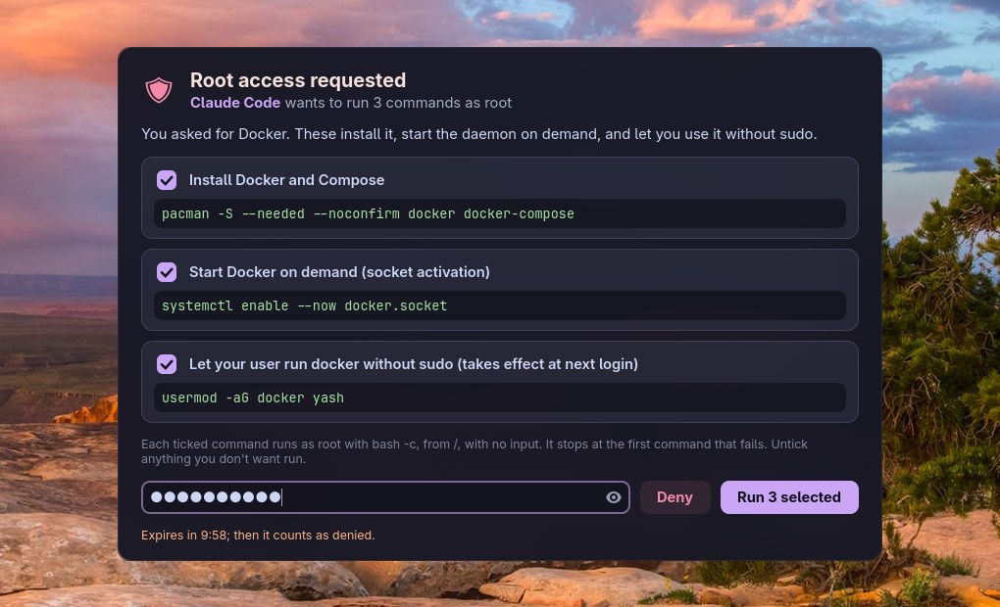
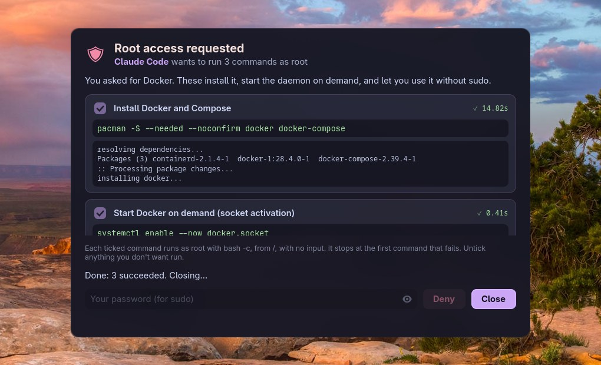

# Tools

Tools the Vayu desktop provides beyond its configs. The first set is for AI
agents. Click a tool in the table to jump to its section.

## AI tools

Vayu gives AI agents (Claude Code, Codex, Aider, or anything that can run a
shell command or speak MCP) desktop tools of their own, so working with an
agent doesn't mean copying commands back and forth. Every tool keeps you in
charge: an agent can ask, only you can approve.

| Tool | What it does | How agents use it |
|---|---|---|
| [vayu-elevate](#vayu-elevate) | Runs root commands an agent asks for, after you see each one and why, tick which to allow, and type your password once. | `vayu-elevate` (JSON on stdin), or the MCP tool `request_root_commands` |

All of them live in [`ai/`](https://github.com/Theyashsawarkar/vayu/tree/development/ai)
and are installed root-owned by `~/dotfiles/ai/apply.sh`, so an agent can't
change what they show you or what they run. `install.sh` installs them;
`vayu-verify` checks them.

## vayu-elevate

**Root commands, approved once.** When an agent needs something done as
root (install a package, enable a service, edit a file under `/etc`), it
sends the commands to `vayu-elevate` instead of asking you to paste them
into a terminal. You approve exactly which ones run; the agent gets the
results.

| At a glance | |
|---|---|
| Command | `vayu-elevate` (JSON on stdin, or `--cmd`/`--why` pairs) |
| MCP | `vayu-elevate --mcp`, tool `request_root_commands` |
| Runs as | root, `bash -c`, from `/`, no stdin, 30 min per command |
| Expires | after 10 minutes without an answer (counts as denied) |
| Logs | `/var/log/vayu-elevate.log` (root-only), `~/.local/state/vayu-elevate/requests.jsonl` |
| Installed at | `/usr/local/bin/vayu-elevate`, `/usr/local/lib/vayu-elevate/` |
| Source | [`ai/elevate/`](https://github.com/Theyashsawarkar/vayu/tree/development/ai/elevate) |

### What you see

A window opens on your desktop with everything the agent asked for:



- every command, exactly as it will run, under the agent's reason for it;
- a checkbox on each: untick anything you don't want run;
- one password field: your password, typed once, for all the ticked commands.

Press **Run** (or Enter in the password field). The ticked commands run one
after another, stopping at the first one that fails, and each card shows its
result. If they all succeed, the window closes by itself a moment later; if
one fails, it stays open with the error until you press Enter, Esc or Close.



A request you don't answer expires after 10 minutes. Three wrong passwords
end it too. Closing the window or pressing Deny means nothing runs.

### Keys

| Key | Does |
|---|---|
| `Enter` (password field) | Run the ticked commands |
| `Esc` | Deny the whole request (nothing runs) |
| `Space` | Tick or untick the focused command |
| `Enter` / `Esc` (after a failed run) | Close the window |

### What's recorded

Every command that ran as root, with its exit code, goes to
`/var/log/vayu-elevate.log`. It's root-only, so the agent can't edit it.
Every request, including denied ones, goes to your own
`~/.local/state/vayu-elevate/requests.jsonl`.

```sh
sudo tail -n 20 /var/log/vayu-elevate.log | jq .
tail -n 5 ~/.local/state/vayu-elevate/requests.jsonl | jq .
```

### For agents: sending a request

Send a JSON request on stdin. It blocks until the user answers (up to 10
minutes), then prints a JSON result.

```sh
vayu-elevate <<'EOF'
{
  "requester": "Claude Code",
  "reason": "Install Docker and start it on demand, as you asked.",
  "commands": [
    {"cmd": "pacman -S --needed --noconfirm docker", "why": "Install Docker"},
    {"cmd": "systemctl enable --now docker.socket", "why": "Start Docker when something connects to it"}
  ]
}
EOF
```

One-off form: `vayu-elevate --requester "Claude Code" --why "Reload udev rules" --cmd "udevadm control --reload"`
(repeat `--why`/`--cmd` pairs for more). `vayu-elevate --schema` prints the
request and result JSON Schema.

Rules for the commands:

- Each runs as root with `bash -c`, from `/`, with **no stdin and no tty**.
  Anything that prompts fails, or hangs until its 30-minute limit: use
  `pacman --noconfirm`, `apt -y`, `cp -f` and the like.
- They run in order and stop at the first non-zero exit; the rest are
  reported as `skipped`.
- Every command needs a `why`: one plain line the user decides from.
- At most 50 commands, 8000 characters each. Control characters and
  invisible Unicode (bidi overrides, zero-width) are rejected, so what the
  user reads is what runs.
- `~` is root's home here. Write `/home/<user>/...` in full.

Ask for exactly what's needed, explain each command honestly, don't re-send
a denied request unless the user asks, and treat a declined command as the
user's answer.

### For agents: reading the result

```json
{
  "status": "completed",
  "message": "Ran the approved commands.",
  "approved": [0, 1],
  "declined": [],
  "results": [
    {"index": 0, "command": "pacman -S --needed --noconfirm docker", "why": "Install Docker",
     "decision": "approved", "state": "ok", "exit_code": 0, "stdout": "...", "stderr": "",
     "duration": 14.2, "timed_out": false, "truncated": false},
    {"index": 1, "command": "systemctl enable --now docker.socket", "why": "...",
     "decision": "approved", "state": "ok", "exit_code": 0, "stdout": "", "stderr": "Created symlink ...",
     "duration": 0.4, "timed_out": false, "truncated": false}
  ]
}
```

| `status` | Meaning |
|---|---|
| `completed` | The user approved at least one command and they ran. Check each result's `state`. |
| `denied` | The user pressed Deny, Esc or closed the window. Nothing ran. |
| `timeout` | No answer within 10 minutes. Nothing ran. |
| `auth_failed` | Wrong password three times. Nothing ran. |
| `error` | Bad request or the tool itself failed; see `message`. |

| Each result's `state` | Meaning |
|---|---|
| `ok` | Ran, exit code 0 |
| `failed` | Ran, non-zero exit code |
| `skipped` | Approved, but an earlier command failed |
| `declined` | The user unticked it |
| `not_run` | The request was denied, timed out or failed before running |

Output is capped at 512 KB per stream (`truncated: true` when cut).

| Exit code | Meaning |
|---|---|
| `0` | Every command was approved and succeeded |
| `1` | An approved command failed |
| `2` | Bad request or tool error |
| `3` | Nothing ran (denied, timeout, wrong password) |
| `4` | Some commands were declined; the approved ones succeeded |

### For agents: over MCP

`vayu-elevate --mcp` is an MCP server (stdio) with one tool,
`request_root_commands`, taking the same request object and returning the
result as both text and `structuredContent`.

Claude Code:

```sh
claude mcp add --scope user vayu-elevate -- vayu-elevate --mcp
```

Any client with an `mcpServers` config (Claude Desktop, Cursor, ...):

```json
{
  "mcpServers": {
    "vayu-elevate": {"command": "/usr/local/bin/vayu-elevate", "args": ["--mcp"]}
  }
}
```

The call blocks until the user answers, up to 10 minutes. If your client
times out tool calls sooner, raise its limit (Claude Code: the
`MCP_TOOL_TIMEOUT` environment variable, in milliseconds).

### Letting agents know about it

Claude Code on this desktop is told about `vayu-elevate` in the global
`~/.claude/CLAUDE.md` (the stowed `claude/` package). For other agents, add
the same few lines to their global instructions file (Codex:
`~/.codex/AGENTS.md`; Gemini CLI: `~/.gemini/GEMINI.md`):

```markdown
- Commands that need root: don't ask me to paste sudo commands. Send them to
  `vayu-elevate` (JSON on stdin: requester, reason, commands: [{cmd, why}];
  see `vayu-elevate --help`). I approve them in a window; you get the results.
```

### Security

`vayu-elevate` is a consent gate: nothing runs as root unless you see it and
type your password.

| Guarantee | How |
|---|---|
| The agent never sees your password | It's typed into the approval window, a separate process the agent didn't start (a transient systemd user service) and can't inspect (marked non-dumpable). |
| What runs is what you saw | The window and the root-side runner are root-owned files the agent can't edit; the window keeps the request in memory once shown; your own GTK styling can't hide part of it; requests with invisible or direction-changing characters are refused. |
| No leftover access | sudo runs with `-k`, so no cached credentials remain for anything else to use. |

What it can't do: protect you from a program that is actively malicious and
already running as your user. Such a program could draw a lookalike window
to collect your password; that's true of every password prompt on a Linux
desktop. Use it with agents you trust to ask honestly, and read the commands
before you approve them.

The exact flow, step by step: [`ai/README.md`](https://github.com/Theyashsawarkar/vayu/blob/development/ai/README.md).
Problems: the "AI tools" entries in [Troubleshooting](TROUBLESHOOTING.md).
